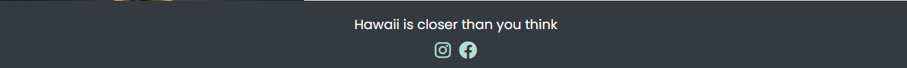
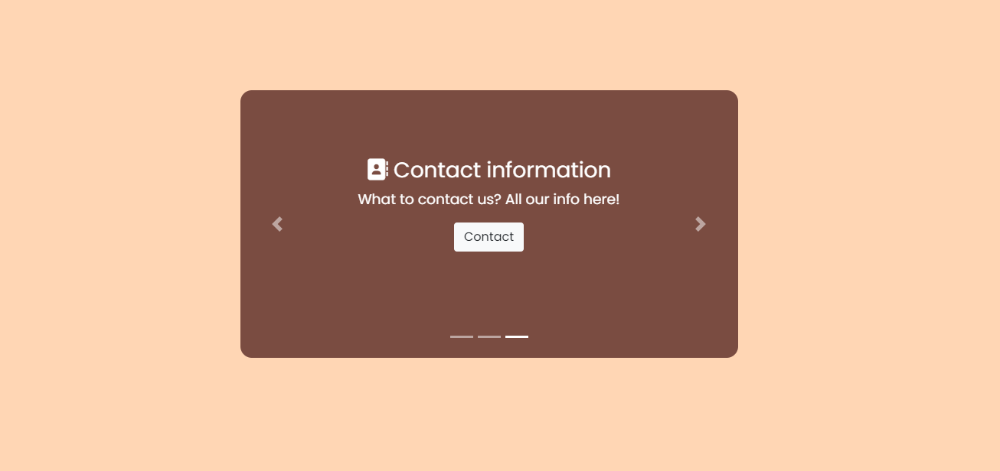
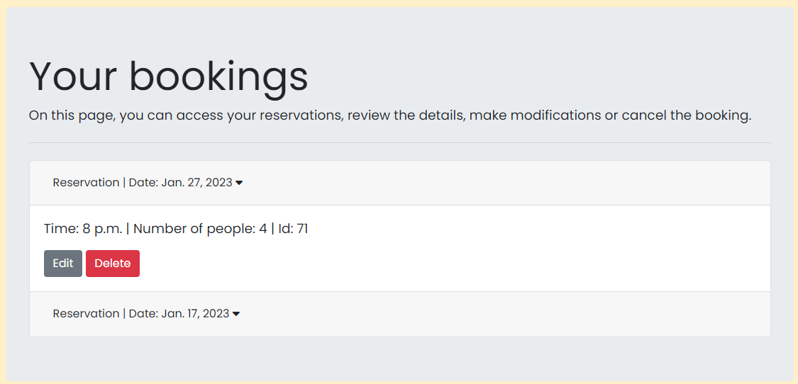

# Table of Contents

-   [1. UX](#ux)
    -   [1.1. Strategy](#strategy)  DONE
        -   [Project Goals](#project-goals) DONE
            -   [User Goals:](#user-goals) DONE
            -   [User stories](#tuser-stories) DONE
            -   [Strategy Table](#strategy-table) DONE
-   [2. Wireframes](#wireframes) DONE
-   [3. Surface](#surface) DONE
-   [4. Database](#database) DONE
-   [5. Features](#features) DONE
-   [6. Technologies Used](#technologies-used) DONE, check for deployement
-   [7. Testing](#testing)
-   [8. Deployment](#deployment)
-   [9. Known Bugs](#known-bugs)
-   [10. Credits](#credits)

# 1 User experience

## 1.1. Strategy

[Go to the top](#table-of-contents)

### Project Goals
* The website features a modern design with minimalistic colors to keep the focus on the content.
* The website is designed to adapt to different screen sizes for optimal accessibility.
* The objective of this project is to simplify the process of user registration, login/logout, creating a user profile, and CRUD functionality for table reservations.

### User Goals:
First Time Visitor Goals:
* As a new visitor, I want to easily make a reservation for a table on my desired date and time.
* As a new visitor, I want to easily access the restaurant's menu to help me make a decision about booking a table.
* As a new visitor, I want to have easy access to the restaurant's contact information.
Returning Visitor Goals

Consolidated customer:
* As a repeat customer, I want to be able to make changes to my existing table reservations.
* As a repeat customer, I want to have the option to cancel a reservation that I previously made.
* As a repeat customer, I want to be able to update my personal profile for future bookings.

All customers:
* Navigation through the interface is straightforward.
* It is easy to view my existing reservations.
* I have the option to reach out to the restaurant for any inquiries

### User stories:
I utilized the GitHub projects board as my project management tool throughout the project by logging all user stories. This helped me to stay on track by moving the necessary tasks to the "in progress" lane as I worked on them and then moving them to the "done" lane once completed.

Backlog 1:


Backlog 2:


Backlog 3:


Backlog 4:


### Strategy Table
Task| Importance| Viability/Feasibility
------------ | -------------------------|---------
Display a food Menu | 5 | 5
Account signup | 5 | 4
User resevation display | 5 | 5
Responsive design | 5 | 5
Contact page | 5 | 5
Create a booking | 5 | 4
Update a booking | 5 | 4
Cancel a booking | 5 | 4
Avoid double bookings | 4 | 3
Multiple table occupancies | 4 | 1
Show already booked tables | 4 | 3

### Scope
The strategy table indicates that not all features can be immediately implemented in the initial release of the project. As a result, the project will be broken down into multiple phases. The initial phase will focus on incorporating the essential features necessary to create the minimum viable product.

Phase 1:
* Showcase the food menu
* Provide the option for users to create an account
* Design that adapts to different screen sizes
* Provide a contact form
* Allow users to make a reservation
* Allow users to make changes to a reservation
* Allow users to cancel a reservation

Phase 2:
* The ability to book multiple tables at once
* A contact form that saves messages to the database
* Send an email confirmation when a reservation is received
* Email verification for account creation


## Wireframes

Home/Landing Page:


Home carrousel:


Home text:


Menu landing:


Menu made poke:


Menu allergens:


Contact landing:


Contact map:


My bookings:


Book a table:


Sign Up:


## Surface

### Color palette

The website primarily utilizes the following colors:
* Cream color: rgba(255,240,201,1)
* Dark brown: rgba(115,68,59,0.95)
* Salmon filter: rgba(254,111,97,0.15)
* The inherent colors from Bootstrap
* White
* Black

The website has been tested for accessibility using WebAIM's contrast checker to ensure that the text and background colors used on the website provide enough contrast for users to read the information displayed on the web.

Contrast check 1:


Contrast check 2:


### Typography

The main font used throughout the website is Poppins. In case Poppins is not imported correctly, the fallback font will be a sans-serif font. The choice of Poppins was made after researching fonts that are optimized for reading

## Database

A diagram of the database model can be seen below:

Database model:


The final database structure is:
```python
class Table(models.Model):
    number_of_seats = models.IntegerField(null=False, blank=False)

    def __str__(self):
        return f'Table {self.id}, seats: {self.number_of_seats}'


class Reservation(models.Model):
    time_services = [
        (datetime.time(13, 0, 0), "13:00"),
        (datetime.time(15, 0, 0), '15:00'),
        (datetime.time(20, 0, 0), '20:00'),
        (datetime.time(22, 0, 0), '22:00')]
    client = models.ForeignKey(User, on_delete=models.CASCADE, related_name='restaurant_booking')
    table = models.ForeignKey(Table, on_delete=models.CASCADE)
    date = models.DateField(null=False, blank=False)
    time = models.TimeField(null=False, blank=False, choices=time_services)

    class Meta:
        unique_together = ["table", "date", "time"]

    def __str__(self):
        return f'{self.date}'
```

## Features

### All pages

The navigation bar is located at the top and its options can vary depending on the user's login status. 

If the user is not logged in:


If the user is not logged in:


Navbar mobile:


The footer, which contains social media icons, is located at the bottom of every webpage. Clicking on these icons will open the corresponding links in a new browser tab.

If the user is not logged in:


### Main page

The main page is composed of three separate sections, all visually appealing to encourage users to book a table at the restaurant.

Main page landing:


Main page carrousel:


Main page text:


### Menu page

The menu page displays all the ingredients and dishes available, clearly indicating which dishes contain allergens, making it easy for those with allergies to know what they can and cannot eat.

Menu page landing:


Menu page made poke:


Menu page made your own poke:


Menu page allergens:


### Contact page
The contact page includes the location, opening hours, and telephone number of the business. Additionally, a cutout of the location on Google maps is provided for easy reference.

Contact page info:


Contact page map:


Menu page allergens:


### Log in / Sign in pages

Sign up:
* The signup form is a straightforward process that requires the user to enter their unique username and a password. 
* To ensure accuracy, the user must re-enter the password for confirmation and it must match the original password entered. 
* There is a message to remind users that if they already have an account, they can click the sign-in link to be directed to the sign-in page.
* If the user enters an username that is already registered, an error message will appear. The signup form includes a feature that checks the password's security.
* If the user enters a password that is not secure, they will be prompted with a message to create a stronger password.
* The signup form verifies that both passwords entered match. If the user enters passwords that do not match, an error message will appear to notify them.

Sign up page:


Log in:
* The login form requires users to enter their username and the password that they used when signing up for the site.
* There is a message to remind users that if they haven't created an account, they can click the signup link to be directed to the signup page. 
* If the user enters the wrong credentials, an error message will be displayed to inform them.

Login page:


Logout: 
* When the user clicks the logout button from the navigation bar, a modal will appear to confirm the action before the user is logged out.

Logout modal:


### Table booking

* This section includes a form that allows the user to book a table at the restaurant.
* The user must specify the date and time of the reservation.
* When a date is chosen, the user will be shown which tables are already booked for that day, so they can select an available table.

Table booking page:


Table booking page with reservations:


### My bookings sections

* This section lists all the reservations made by the user at the restaurant.
* Each reservation includes a toggle button that, when clicked, displays more information, including buttons to edit or delete the reservation.
* In case the user has not made any bookings, a button will appear in this section that redirects the user to the booking page.

My bookings with reservations:


My bookings with NO reservations:


### Messages
Certain actions on the website will trigger messages to appear at the top of the page. The color of message is used to indicate the status of the action, such as a green message indicating a successful action and a red message indicating a failure or rejection.

* Accepted reservation (green): The reservation has been accepted and confirmed.
* Denied reservation (red): The reservation has been denied or rejected.
* Deleted reservation (green): The reservation has been deleted successfully.

Messages:


## Technologies used

### Programing languages
* HTML5
* CSS3
* JavaScript
* Python

### Frameworks and libraries
* Django: Including Django Allauth
* Bootstrap 4.6
* Google fonts
* Font awesome

### Database Management
* Heroku Postgres

### Other tools
* Git
* GitPod
* Github
* Heroku
* Am I responsive
* W3C Markup Validator
* W3C CSS Validator

## Testing

### Code validator
The W3C Markup Validator was utilized to conduct a thorough check for errors within the HTML and CSS pages. Only one error was identified in the HTML files, and none in the CSS files. The error was promptly resolved.

Error HTML:


CSS no errors:


The JavaScript code was checked for errors using JSHint. One error was identified and resolved.

JS errors:


JS no errors:


GitPod was used to validate the python code and identify any errors. While most errors were resolved, some were left unresolved because resolving them would imply improper syntax. These errors are listed and described below.

Python errors:


### TDD

Some testing was automated. These test can be seen in the file: test_forms.py. Only the form was tested using TDD, but the same principles could be applied to the views and models.

### Manual testing

#### All Pages:
TEST            | OUTCOME                          | PASS / FAIL  
--------------- | -------------------------------- | ---------------
Home page | When the "home" button in the navigation bar is clicked, the browser redirects the user to the home page and the "active" styling appears on the home button | PASS
Menu page |When the "menu" button in the navigation bar is clicked, the browser redirects the user to the menu page and the "active" styling appears on the menu button.  | PASS
Contact page | When the "contact" button in the navigation bar is clicked, the browser redirects the user to the contact page and the "active" styling appears on the contact button. | PASS
Table bookingpage | When the "Table booking" button in the navigation bar is clicked, the browser redirects the user to the Table booking page and the "active" styling appears on the Table booking button.| PASS
My booking page | When the "My booking" button in the navigation bar is clicked, the browser redirects the user to the My booking page and the "active" styling appears on the My booking button. | PASS
Edit profile page | Checked foreground information is not distracted by backgrounds| PASS
Register page |  When the "Register" button in the navigation bar is clicked, the browser redirects the user to the Register page and the "active" styling appears on the Register button. | PASS
Foreground & background colour | Checked foreground information is not distracted by background color or images | PASS
Text | Checked that all fonts and colours used are consistent. | PASS

#### Footer
TEST            | OUTCOME                          | PASS / FAIL  
--------------- | -------------------------------- | ---------------
Facebook | When the Facebook icon is clicked, a new tab will open and the user will be redirected to the Facebook website. | PASS
Instagram | When the Instagram icon is clicked, a new tab will open and the user will be redirected to the Instagram website. | PASS

#### Home
TEST            | OUTCOME                          | PASS / FAIL  
--------------- | -------------------------------- | ---------------
Media | All media assets are displayed correctly, without any pixelation or stretched images, and are responsive on all devices. | PASS
Responsiveness | All elements on the page have been checked to ensure consistent scalability across mobile, tablet, and desktop views..| PASS
Accessibility |The accessibility of the page has been checked using Lighthouse.| PASS
Carrousel | The links in the carousel are functional and take the user to the correct pages. | PASS
Carrousel login | The information displayed in the carousel is dynamic and depends on the user's login status. | PASS

Lightouse:


#### Menu page
TEST            | OUTCOME                          | PASS / FAIL  
--------------- | -------------------------------- | ---------------
Media | All media assets are displayed correctly, without any pixelation or stretched images, and are responsive on all devices. | PASS
Responsiveness | All elements on the page have been checked to ensure consistent scalability across mobile, tablet, and desktop views.| PASS
Accessibility |The accessibility of the page has been checked using Lighthouse.| PASS

Lightouse:


#### Contact page
TEST            | OUTCOME                          | PASS / FAIL  
--------------- | -------------------------------- | ---------------
Map | The map asset is displayed correctly, without any pixelation or stretched images, and is responsive on all devices. | PASS
Responsiveness | All elements on the page have been checked to ensure consistent scalability across mobile, tablet, and desktop views.| PASS
Accessibility |The accessibility of the page has been checked using Lighthouse.| PASS

Lightouse:


#### Sign Up page
TEST            | OUTCOME                          | PASS / FAIL  
--------------- | -------------------------------- | ---------------
Media | All media assets are displayed correctly, without any pixelation or stretched images, and are responsive on all devices. | PASS
Responsiveness | All elements on the page have been checked to ensure consistent scalability across mobile, tablet, and desktop views.| PASS
Accessibility |The accessibility of the page has been checked using Lighthouse.| PASS
Register form | Checked the form submits only when all required fields are filled out. | PASS
Sign in link | Checked the sign-in link redirects to the sign-in page. | PASS

Lightouse:


#### Log in page
TEST            | OUTCOME                          | PASS / FAIL  
--------------- | -------------------------------- | ---------------
Media | All media assets are displayed correctly, without any pixelation or stretched images, and are responsive on all devices. | PASS
Responsiveness | All elements on the page have been checked to ensure consistent scalability across mobile, tablet, and desktop views.| PASS
Accessibility |The accessibility of the page has been checked using Lighthouse.| PASS
Sign in form | Checked the form submits only when all required fields are filled out. | PASS
Signup link | Checked the signup link redirects to the signup page. | PASS

Lightouse:


#### Book table page
TEST            | OUTCOME                          | PASS / FAIL  
--------------- | -------------------------------- | ---------------
Media | All media assets are displayed correctly, without any pixelation or stretched images, and are responsive on all devices. | PASS
Responsiveness | All elements on the page have been checked to ensure consistent scalability across mobile, tablet, and desktop views.| PASS
Accessibility |The accessibility of the page has been checked using Lighthouse.| PASS
Form | Checked the form submits only when all required fields are filled out. | PASS
Date picker | When a date is selected, all reservations made for that day are displayed.| PASS

Lightouse:


#### My bookings page
TEST            | OUTCOME                          | PASS / FAIL  
--------------- | -------------------------------- | ---------------
Media | All media assets are displayed correctly, without any pixelation or stretched images, and are responsive on all devices. | PASS
Responsiveness | All elements on the page have been checked to ensure consistent scalability across mobile, tablet, and desktop views.| PASS
Accessibility |The accessibility of the page has been checked using Lighthouse.| PASS
Dropdown | Clicking on a reservation activates the dropdown, showing the edit and delete button. | PASS
Edit |Clicking on the edit button takes you to the edit page. | PASS
Delete |When the delete button is clicked, a modal appears to confirm the action before it is executed. | PASS
No reservation |A button linking to the book table page is present and functional.| PASS

Lightouse:


#### Edit table page
TEST            | OUTCOME                          | PASS / FAIL  
--------------- | -------------------------------- | ---------------
Media | All media assets are displayed correctly, without any pixelation or stretched images, and are responsive on all devices. | PASS
Responsiveness | All elements on the page have been checked to ensure consistent scalability across mobile, tablet, and desktop views.| PASS
Accessibility |The accessibility of the page has been checked using Lighthouse.| PASS
Form | Checked the form submits only when all required fields are filled out. | PASS

Lightouse:


## Credits

* Media: All images are taken from Pexels 
* Code: Stack Overflow and W3Schools were frequently consulted for inspiration and to improve understanding of the implemented code.